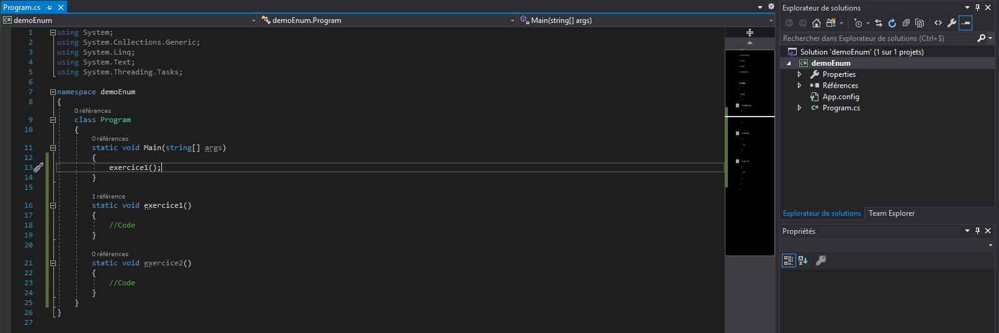
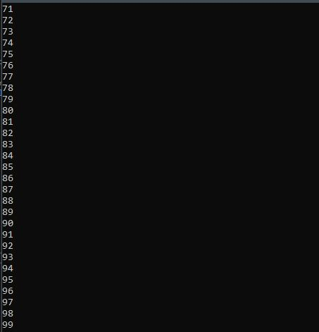
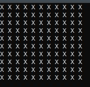

# Exercice de C#

## Exercice en application console (.Net Framework)

### Pré requis & consigne

- Créer une application console (.Net Framework) avec le nom de votre choix.
- Pour chaque exercice créer une nouvelle fonction comme ci dessous.

    

- Les temps estimés sont basé sur un niveau débutant en programation.

### Exercice 1 : 

Consigne : Réaliser une fonction permettant d'afficher une suite de 100 éléments.

Temps Estimé : inférieur à 30 minutes.

Résultat attendu : 

    

### Exercice 2 : 

Consigne : Réaliser une fonction permettant d'afficher un tableau de 10 colonnes sur 10 lignes remplit de la lettre "X".

Temps Estimé : inférieur à 30 minutes.

Résultat attendu : 

    

### Exercice 3 : 

Consigne : Réaliser une fonction permettant à l'utilisateur de taper des mots. Ces mots doivent être stocker dans une *List*. Afficher à l'écran la liste de mots à l'utilisateur à chaque fois qu'il tape un nouveau mot.

Astuce : Une boucle "infini" est nécessaire.

Temps Estimé : supérieur à 30 minutes & inférieur à 1 heure.

### Exercice 4 : 

Consigne : Réaliser une fonction permettant de remplir un tableau avec 10 nombres aléatoires. La fonction exercice4 doit retourner le tableau afin qu'il puisse être utilisé dans la fonction *static void Main(string[] args)*.

Temps Estimé : inférieur à 20 minutes.

### Exercice 5 : 

Consigne : Réaliser une fonction permettant de trier un tableau, vous utiliserez le tableau retourner dans l'exercice4. Vous pouvez utilisé la méthode de tri que vous souhaitez.

Temps Estimé : supérieur à 45 minutes & & inférieur à 1 heure et demi.

### Exercice 6 :

Consigne : Réaliser une fonction permettant de faire un menu dans une console. Ce menu comprendra 4 éléments selectionnable : 
- 1: Date
- 2: Hello
- 3: Addition
- 4: Quitter

Il faut qu'on puisse choisir un élément en tapant un chiffre entre 1 et 4. Lorsque qu'un chiffre est tapé l'action lié à l'élément se produit et on réaffiche le menu sauf pour l'option "Quitter".

L'élément 1. Date : affiche la date du jour.
L'élément 2. Hello : affiche "Bonjour Samuel: ", Samuel est saisi par l'utilisateur.
L'élément 3. Addition : additionne deux nombres saisis par l'utilisateur et donne le résultat.
L'élément 4. Quitter, quitte le menu.

Temps Estimé : supérieur à 2 heures.

### Exercice 7 : 

Consigne : Réaliser une fonction permettant de faire une calculatrice au format console. La calculatrice aura un menu proche de celui de l'exercice 6. Chaque nombre sera tapé par l'utilisateur.
Menu de la calculatrice console : 
- 1: Addition
- 2: Soustractrion
- 3: Multiplication
- 4: Division
- 5: Quitter

Il est nécessaire de gérer les erreurs, chaque opération n'utilise que deux nombres saisis par l'utilisateur et l'utilisateur voit le résultat s'afficher. 
Il faut que le menu se réaffiche après chaque opération sauf "Quitter".

Temps Estimé : supérieur à 1 heure & & inférieur à 1 heure et demi.